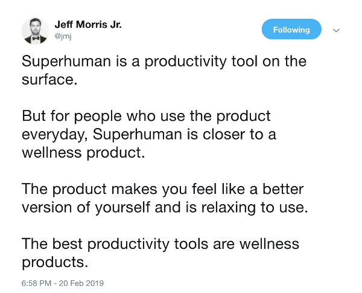

---

title: Everything counts

date: "2019-04-21T22:12:03.284Z"

excerpt: ""

---

Back in 2016, I attended the Boston stop of the Intercom World Tour (I even made the event photos). One talk that night changed the way I view my work with software companies. Then-Director of Growth Ben McRedmond shared his concern with the popular definition of growth focused primarily on acquisition. To him, growth should instead be a function of helping customers make progress in their lives and a growth team a group that solves business problems. I still think about this sentiment every day, years later.

This week, I’ve been thinking about why the lines between traditional business functions like sales, product, and marketing should be blurry at best for early-stage companies.

The software we sell is becoming commoditized and the markets we sell into, more competitive. To build sustainable companies, we must go beyond functional features and craft holistic experiences for our customers.

This quote from the Oracle customer experience team summarizes why end-to-end customer experiences are so important:

> A customer's experience with a brand is inseparable from what the brand sells. So we need to up our game at every moment a customer interacts with us.

Think about the companies you love and interact with most often. Do you love them for the features of their product or for the way you feel about them as a company?

Here's a good example of how Superhuman succeeds at going beyond features to win customer's love and attention.

So why is it so important to think holistically about the experience your customers receive? Because there is no isolated “product experience’, ‘sales experience’, or ‘marketing experience’.

Individual business functions may be responsible for an isolated piece of the experience, but to the customer, there is only a single ‘company’ experience.

Who is responsible for the overall customer experience at your company? What tactics do you use to ensure success throughout a customers entire journey?