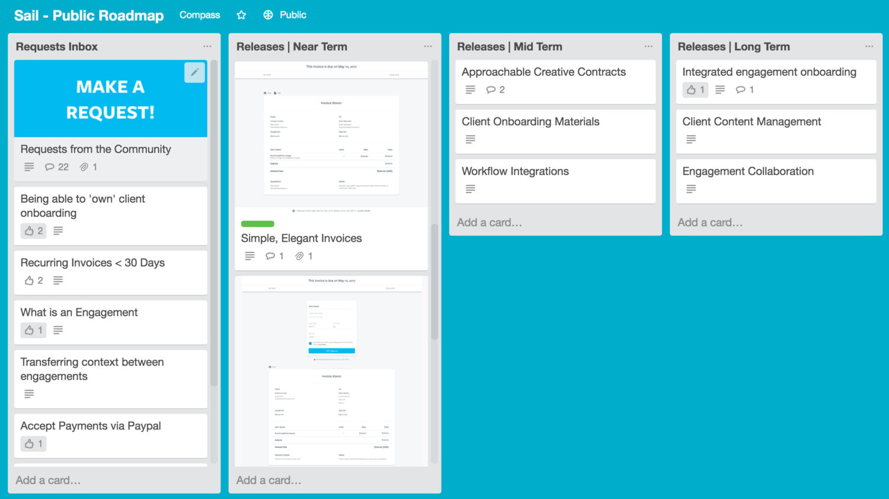
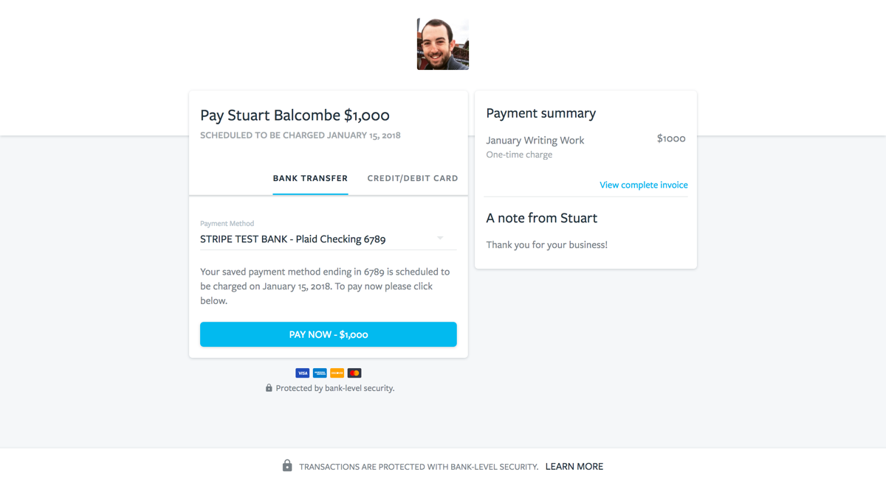

---

title: Designing client payment experiences

date: "2018-02-21T22:12:03.284Z"

---

## Problem & Opportunity
On the surface, freelancers seem to have it all. They can be their own boss, take back their independence, and only spend time doing what they love. It turns out running a freelance business is a little more involved than that.

One thing that every freelancer has to figure out, is how they are going to get paid for their work. Unfortunately, leaving a full-time job means no more administrative support. We began interviewing  freelancers to learn more about how they got paid by their clients. This process helped identify their frustrations with their existing solution.

We identified three high-level solutions that freelancers were using to get paid.

**Offline Solutions -** This group often created invoices using Excel or a free invoice template tool and accepted checks as payment.

**Online Invoicing Solutions -** Many freelancers used an online accounting tool that supported invoicing and online payments. Examples included Quickbooks, Freshbooks, Wave, Paypal Invoicing, and HelloBonsai.

**Consumer Payment Solutions -** An unexpected discovery was the number of freelancers who used a consumer payments products like Venmo or PayPal to get paid for their work.

The most common frustration expressed by the people we interviewed was late or non-payment of invoices for completed work. This frustration was shared across each solution type. Freelancers often waited weeks or months after work was complete to receive payment.

A secondary frustration that freelancers using Offline Solutions or even Online Invoicing Solutions reported was the perceived amount of time it took to send an invoice because it felt like an administrative task. Several freelancers told us they often delay sending invoices to clients several weeks after work was complete.  

## Introducing Sail Payments
A secure way to get paid that’s simple to use and designed for freelancers who have personal relationships with their clients. The goal of our first release was to provide freelancers with greater control over payments by saving a client’s card on file.

## Process

The first step was to understand the motivations driving freelancers existing behavior. I used job stories to add context to the problems identified in my research.

> When I work with a freelance client, I want to spend less time sending invoices and chasing late payments. So I can spend more time doing the work I love.

> When I work with a freelance client, I want to provide a professional payment experience. So I can build trust with my client.

These job stories formed the basis of the initial problem brief I communicated to the team. I included quotes from my user research to provide extra context where required. At this stage, we also determined how we would measure the success of the project. The key events we decided to track for the initial release were:

**Acquisition:** The number of new accounts created.
**Activation:** The number of acquired users who sent a payment request.
**Retention:** The number of users who sent more than 1 payment requests in a rolling 30 day period.

With the problem defined the next step was to begin designing possible solutions.

#### Designing the initial solution

I began by mapping out 5 key user flows that were critical for freelancers to get paid on time by their clients.

With the initial mockups complete, I created an Invision prototype and began scheduling user testing sessions to get feedback before changes were committed to code.

These early tests helped us iterate on the solution design before committing changes to code. User feedback also helped ensure that our initial release was the smallest valuable product possible. I scheduled design reviews and release planning meetings with our engineers to answer questions. Maintaining a short feedback loop helped ensure alignment with the learnings from our user interviews.

Shipping fast was a top priority of the product team. We created a lightweight workflow in Github to ensure everyone had the context they required at all times. A single project brief linked all relevant documents along with any prototypes or conversations.

## Payment request workflow
Our initial user research identified ease of requesting payment and providing a professional client experience as key requirements. I developed a UI that focused on reducing the number of actions required to send an invoice, while empowering users to customize the payment experience for their clients as required. 

#### Designing for transparency
Freelancers typically establish personal relationships with their clients over the course of a project. Effective communication is very important for establishing trust and building a personal brand. Our goal was to ensure freelancers felt comfortable using Sail as an extension of their brand. To do this, we needed to help freelancers understand the experience their clients would have while making payments with Sail. In the payment request workflow, freelancers can customize the experience their client will have and quickly understand what their client will see. We also provided the option to preview all communication that would be sent to clients by Sail on their behalf. This step was particularly important for first time users who may still be considering whether to switch from their existing solution.

#### Scheduling automatic payments
The scheduled payment workflow was designed to provide freelancers with the option to automatically charge a clients card on a specified date rather than requiring an action from their client. We found during our early research that many clients who made late payments did not intend to miss their due date but that paying an invoice was simply not top of their to do list.

By saving a payment method on file, clients would not be required to enter their card information each time they paid. Existing invoicing solutions required client actions in all cases regardless of the relationship or terms the client and freelancer had in place. By providing the option to schedule payments, freelancers have the option to remove client actions as a dependency to payment.

## Tracking changes and responding to user feedback
We launched Sail in closed beta and created a user survey to ensure we only sent invites to freelancers who could use Sail’s current feature set. The survey received more than 100 responses and provided valuable data on the problems potential users were trying to solve.

I was responsible for customer support and user communication via both live chat and email. As freelancers began using the product and visiting the marketing site, I triaged conversations in Intercom and added new feature requests to our Public Roadmap. I communicated new insights and learnings to the team during daily recaps. We prioritized feature requests during a weekly roadmap review meeting.

Maintaining a dialogue with early users ensured I was able to get high fidelity feedback and gain a deep understanding of how the product was being used. This feedback helped to reduce the time needed to understand and ship new features and helped build brand evangelism.

## Iterating on the payment request workflow
While our initial solution helped freelancers significantly reduce the time required to send invoices and track payments we needed to iterate quickly in response user feedback. We realized there was an opportunity to ship an opinionated solution and provide freelancers with more flexibility while providing an improved payment experience for their clients.

**Observation #1 -** Less than 5% of active users viewed the client preview in the payment request flow.

**Observation #2 -** More than 85% of respondents to our beta survey requested a recurring payments feature.

**Observation #3 -** 70% of invoices sent using Sail had a single line item.

#### Lightweight Payment Requests
Referring back to our initial customer research, we decided to ask:

> How can we make getting paid as a freelancer as easy as getting paid by a friend using Venmo?

Freelancers typically have one-to-one relationships with their clients. The initial payment request UI was designed to ensure this relationship was enhanced by providing transparency into what clients would experience. However, usage data showed that after the first use less than 2% of users were making changes to their client's experience.

Rather than forcing users to navigating a verbose UI, I designed a streamlined flow to reduce the time required to send a payment request. I created a new prototype in Invision and began testing the flow side-by-side against our existing solution with users.

#### Charges vs Invoices
The initial release of Sail payments allowed clients to save payment methods on file and schedule future charges. In the first few weeks after launch the most common feature request we got was to offer recurring billing. We discovered that many users who worked with clients on an ongoing basis billed on a set payment schedule, but still wanted to control when their client was charged. We added the option to immediately charge a saved payment method to fit this behavior and provide greater flexibility than subscribing clients to a fixed plan.

At the same time we also decided to de-prioritize the role of invoices in the payment flow. Looking at user data helped us understand how invoices were being used and design a more focused payment experience.

## Results & Lessons Learned
I worked on creating a simple solution to a problem that was prohibitive for most freelancers to build themselves. Sail now has more than 20 monthly active users and has processed north of $125k in client payments in the 6 months since it's launch in July 2017.

> Sail allows me to bill my clients professionally and get paid in the most efficient way possible.
> 
> – Hicham Moutahir, Owner, Shibi Designs

Running an independent business requires freelancers to be marketers, strategists, accountants, and managers. Making it easier to understand business finances will not only give freelancers more time to focus on their clients but will help them run more profitable businesses.