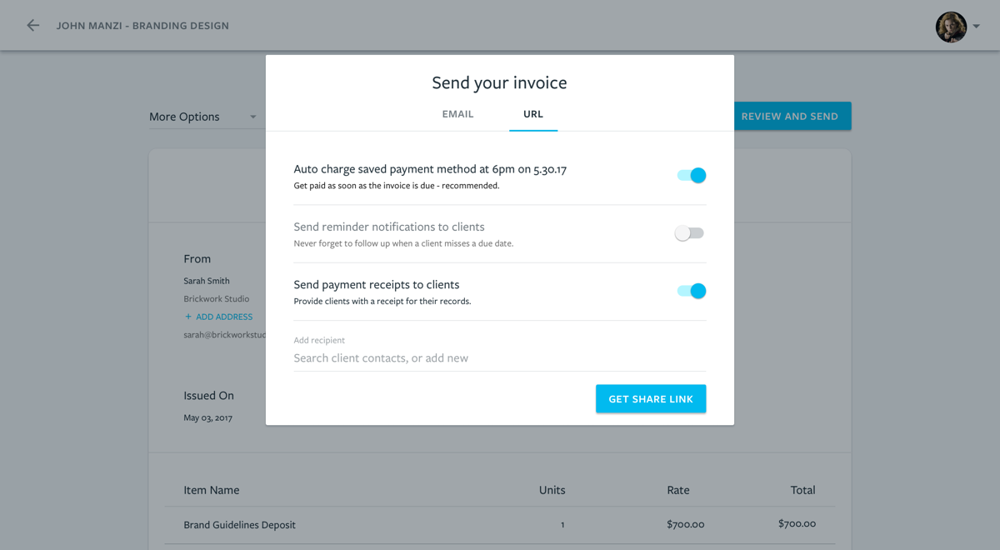

## Problem & Opportunity
On the surface, freelancers seem to have it all. They can be their own boss, take back their independence, and only spend time doing what they love. It turns out running a freelance business is a little more involved than that.

One thing that every freelancer has to figure out, is how they are going to get paid for their work. Unfortunately leaving a steady full-time job means there is no more accounting department and no more payroll. Keeping that in mind, we began interviewing creative freelancers about how they got paid by their clients and started to identify the frustrations they had with their existing solutions.

During our research, we identified three very different high-level solutions that freelancers were using to get paid for their work.

**Offline Solutions -** Some of the freelancers I spoke to were not using a specific payments tool to get paid for their work. This group often created invoices manually using an Excel template or used a free invoice template tool to request payment and accepted checks.

**Online Invoicing Solutions -** Many freelancers I interviewed and who responded to our beta survey used an accounting tool that supported invoicing and online payments to get paid by their clients. Examples included Quickbooks, Freshbooks, Wave, Paypal Invoicing, and HelloBonsai.

**Consumer Payment Solutions -** An unexpected discovery was the number of freelancers (most commonly moonlighters) who used a consumer payments solution like Venmo or a personal PayPal account to get paid for their work.

The most common frustration expressed by the people we interviewed was late or non-payment of invoices for completed work. This frustration was shared across each solution type with freelancers often waiting weeks or even months after work was complete to receive payment.

A secondary frustration that freelancers using Offline Solutions or even Online Invoicing Solutions reported was the perceived amount of time it took to send an invoice because it felt like an administrative task. Several freelancers told us they often delay sending invoices to clients several weeks after work has been completed. 

## Introducing Sail Payments
A powerful and secure way to get paid that’s simple to use and designed specifically for freelancers who have personal relationships with their clients. Our first release focused on providing freelancers with greater control over payments by saving a client’s card on file while making it easy to send professional invoices.

## Process

The first step to designing an initial solution was to understand freelancers current processes and the motivations driving their existing behavior. I used job stories to add context to the problems identified in my research.

> When I work with a freelance client, I want to spend less time sending invoices and chasing late payments. So I can spend more time doing the work I love.

> When I work with a freelance client, I want to provide a professional payment experience. So I can build trust with my client.

These job stories formed the basis of the initial problem brief I communicated to the team, along with excerpts from our user research to provide some additional context where required. At this stage, we also determined how we would measure the success of the project using both quantitative and qualitative measures. The key events we tracked for the initial release were:

**Acquisition:** The number of new accounts created.
**Activation:** The number of acquired users who sent a payment request.
**Retention:** The number of users who sent multiple payment requests in a rolling 30 day period.

With the customer problem clearly defined the next step was to begin designing possible solutions.

#### Designing the initial solution

I began by mapping out 5 key user flows that would be required to support the freelancer's job of getting paid on time by their clients.

With the initial mockups complete, I created an Invision prototype and began scheduling user testing sessions to get feedback before changes were committed to code.

Conducting early user tests helped us ensure that our initial release was scoped to the smallest valuable product we could ship. I scheduled design reviews and release planning sessions with our engineers to answer questions and ensure that the solution we shipped was aligned with the learnings from our beta user interviews. 

To ensure our team was able to move quickly, we created a lightweight workflow in Github to ensure everyone had the context they required at all times. All project documents were linked from the project brief in Github along with any Invision prototypes or project conversations.

## Payment request workflow
Our initial user research identified ease of requesting payment and providing a professional client experience as key requirements. I developed a UI that focused on reducing the number of actions required to send an invoice, while empowering users to customize the payment experience for their clients as required. 

#### Designing for transparency
Freelancers typically establish personal relationships with their clients over the course of a project. The way they communicate and present themselves is very important for establishing trust and building their personal brand. Our goal was to ensure freelancers felt comfortable using Sail as an extension of their brand. To do this, we needed to help freelancers understand the experience their clients would have while making payments with Sail. In the payment request workflow, freelancers can customize the experience their client will have and quickly understand what their client will see. We also provided the option to preview all communication that would be sent to clients by Sail on their behalf. This step was particularly important for first time users who may still be considering whether to switch from their existing solution.

#### Scheduling automatic payments
The scheduled payment workflow was designed to provide freelancers with the option to automatically charge a clients card on a specified date rather than requiring an action from their client. We found during our early research that many clients who made late payments did not intend to miss their due date but that paying an invoice was simply not top of their to do list.

By saving a payment method on file, clients would not be required to enter their card information each time they paid. Existing invoicing solutions required client actions in all cases regardless of the relationship or terms the client and freelancer had in place. By providing the option to schedule payments, freelancers have the option to remove client actions as a dependency to payment.

## Tracking changes and responding to user feedback
We initially launched Sail in closed beta and created an application survey to ensure we sent invites only to freelancers who would benefit from Sail’s current feature set. The survey was completed by more than 100 freelancers and provided valuable data on the problems potential users were trying to solve.

I was responsible for customer support and user communication via both live chat and email. As freelancers began using the product and visiting the marketing site, I triaged conversations in Intercom and added new feature requests to our Public Roadmap. I communicated new insights and learnings to the team during daily recaps and ran a weekly roadmap review meeting to prioritize incoming requests.

By maintaining a personal dialogue with our early users I was able to get high fidelity feedback as we tested new features and gain a deep understanding of how the product was being used in their daily workflow. This feedback helped to reduce the time needed to understand and ship new features and helped build brand evangelism.

## Iterating on the payment request workflow
While our initial solution helped freelancers significantly reduce the time required to send invoices and track payments we needed to iterate quickly in response user feedback. We realized there was an opportunity to ship an opinionated solution and provide freelancers with more flexibility while providing an improved payment experience for their clients.

**Observation #1 -** Less than 5% of active users viewed the client preview in the payment request flow.

**Observation #2 -** More than 85% of respondents to our beta survey requested a recurring payments feature.

**Observation #3 -** 70% of invoices sent using Sail had a single line item.

#### Lightweight Payment Requests
Referring back to our initial customer research, we decided to ask:

> How can we make getting paid as a freelancer as easy as getting paid by a friend using Venmo?

Freelancers typically have one-to-one relationships with their clients. The initial payment request UI was designed to ensure this relationship was enhanced by providing transparency into what clients would experience. However, usage data showed that after the first use less than 2% of users were making changes to their client's experience.

Rather than forcing users to navigating a verbose UI, I designed a streamlined payment request flow with the goal to reduce the time required to send a request. I created a new prototype in Invision and began testing the flow side-by-side against our existing feature with users.

#### Charges vs Invoices
The initial release of Sail payments allowed clients to save payment methods on file and schedule future payments to be charged automatically. In the first few weeks after launch the most common feature request we got was to offer recurring billing. We discovered that many users who worked with clients on an ongoing basis billed on a set payment schedule, but still wanted to control when their client was charged. We decided to enable the option to immediately charge a saved payment method to fit this existing behavior and provide greater flexibility than requiring clients to be subscribed to a fixed plan.

At the same time we also decided to de-prioritize the role of invoices in the payment flow. Looking at our user data allowed us to understand how invoices were being used and design a more focused payment experience.

## Results & Lessons Learned
I worked on designing a simple solution to a problem that was too technically prohibitive for most freelancers to implement themselves. Sail now has more than 20 monthly active users and has processed just north of $125k in client payments in the 6 months since launching in July 2017.

> Sail allows me to bill my clients professionally and get paid in the most efficient way possible.
> 
> – Hicham Moutahir, Owner, Shibi Designs

Running an independent business requires freelancers to be marketers, creatives, strategists, accountants, and managers. Making it easier to understand the financial side of freelance businesses is an exciting challenge that will not only give freelancers more time to focus on providing value for their clients but will help to professionalize their perception to the clients they hire.
