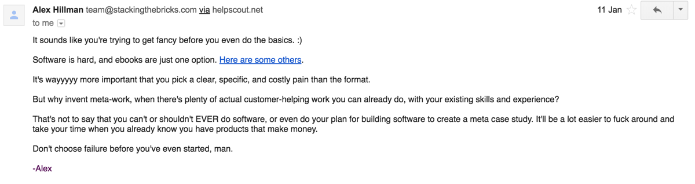

*This is an update from the halfway point of my [web app challenge](/tags/web-app-challenge/). On January 15th this year I challenged myself to build a software product and generate $1000 in real revenue in 3 months.*

### Building software is hard
I set out in January with a clear plan for building a software product that could get me to my revenue goal of $1000 by April 10th. I intended to use my experience building Sail to create a [simple payments tool](https://www.paymentlink.me) aimed at independent consultants selling productized services. As it happened I spent the first 6 weeks having lots of interesting conversations and creating [multiple landing pages](/a/how-to-create-effective-landing-pages-for-testing/) without actually building and shipping a product. 

As someone with limited development experience I found myself running into one challenge again and again: 

> How could I balance learning to code a production ready app with delivering value to customers.

My time logs for the challenge highlight my dilemma:

- Time spent learning to code: **35 hours (57%)**
- Everything else: **26 hours (43%)**

The real problem that these numbers highlight is that I spent 35 hours not talking to customers and not shipping.

My rationale for building a software product was that I had [existing experience](/a/designing-one-to-one-payment-experiences/) with the product development process from ideation through to launch. I already had a framework in place for conducting user research, prototyping a solution, handing off the design for development and marketing a launch.

In week 5 of the challenge, I decided to create a [prototype without any code](/a/validating-product-ideas-no-code-required/) for one of my product ideas. The prototype took just 30 minutes to build using Zapier and Google Sheets and allowed me to quickly test the concept with potential customers. Ultimately, I discovered that I would still need code to release the product but I learned that lesson in less than an hour rather than waiting until after I launched. 

I was back at the piece of the process where I wasn't able to leverage my existing skills. The actual development of the software itself. Even with modern day tools like Firebase and the countless tutorials available online, building software is hard.

In retrospect, I could have saved myself a lot of time by following the advice of people who already build products for themselves and not tried to build a software product at all. Here’s the response I got when I shared the plan for my web app challenge plan with Alex Hillman at [Stacking the Bricks](https://stackingthebricks.com) back in January.

> Unlike a video game, business doesn't give you bonus points for playing on "difficult" mode. – Alex Hillman

Since this email, I’ve also had received similar advice from Justin Jackson and Kai Davis.

### Focus on what you're good at

I was on a consulting call recently when my client asked an interesting question about my branding design abilities.

> Is this in your top 5 skills?

While I understand some branding basics I am not a branding specialist so I answered no. This question brought me to an interesting realization. 

> Would I hire myself to write code for a software product? 

Writing code is definitely not the only step in building a software product (far from it in fact) but it is usually required. Had I asked myself this question when starting the product challenge I probably wouldn't have set out to build a software product. As already discussed in this post I am not a developer. My strengths are customer research, UX design, and prototyping. While I can write code it's not something that's a particularly high leverage activity for me.

There is a caveat here. Just because you aren't a developer or only know a little code doesn't mean you can't build a software product. There are plenty of examples of people who learned as they went and made it work. Maybe I'll build a software product myself in the future.

### Answer recurring questions

Over the past few months, I’ve written about my search for the right [problem to solve](/a/solving-the-right-problems/). I've explored building tools for people I've worked with before, and products to solve problems I have myself. A common theme, however, is that each of the problems I considered would need me to learn something new to provide value to my customers.

A couple of weeks ago I noticed something interesting about my conversations with potential consulting clients. Here are a few of the questions I found myself answering on a regular basis:

> What should be included in the scope of our initial product release?

> When we're building our product, how long should we wait to test it with our users?

> How can I validate my idea before hiring a developer so I don’t build the wrong thing and waste time?

> We want to start building products in-house. How should we approach testing and validating our ideas? 

While people may have been enquiring about my [UX design services](/work-with-me) they were also asking questions about strategies for validating and building their products.

I noticed that I was able to answer these questions by leveraging my experience as a product manager and sharing examples from previous projects. I started asking the people I spoke to what they believed the answering these questions would help them achieve in their business.

Common responses included:

> I can be more confident in my product strategy knowing that I have evidence people will buy the product I build.

> I can save thousands of dollars in contract development cost if I can validate my product idea before hiring someone.

> I can provide my developers with a clearer picture of how the product will work, saving them time in the development process.

People were already paying me to answer these questions as part of consulting projects, so I began to think about how I could productize this knowledge.

### Compound your efforts

Building anything valuable requires focus and concentrated effort.

By keeping the scope of my product constrained to things I already know I can also leverage other things about my existing activities.

For example:

- My existing clients are all potential customers and case studies. 
- My previous experience building products contains lessons and examples I can use.
- I already hang out online in places where the people who might pay for my expertise hang out too.

Instead of building a software product that is tangential to my existing activities and I can create something that is aligned with them and more valuable because of it.

### What does this mean for the challenge?

Over the next 4 weeks, I’m going to be laser-focused on writing an eBook about [Prototyping Software Products](/prototyping-software-products). The book will help non-technical founders test and validate their product ideas through research and [prototyping without code](/a/validating-product-ideas-no-code-required/) saving them the time and money required to hire a developer for a product customers won’t buy.

I’ve already written an outline, created a [landing page](/prototyping-software-products) and had several very interesting conversations with non-technical founders. My plan is to write just over a chapter a week to be able to start selling the book on April 2nd.

Here’s a quick overview of what I expect to cover in the book:

- How to build something people want by talking to your users.

- The importance of testing your product with real users before you write any code.

- How to create a working prototype using existing tools like Typeform, Zapier and Twilio.

- How to demo your product with users with prototyping tools like Invision.

- The steps you should take before and after launch to get feedback from your users and improve your product.

**How you can help**

- Sign up to get Prototyping Software Products as soon as it’s ready [here](/prototyping-software-products).

- If there is anything about validating and testing product ideas you’d like to know more about, get in touch and [let me know](mailto:stuartbalcombe@gmail.com) so I can include it in the book.

