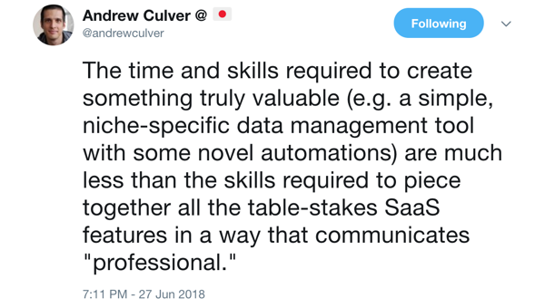

Do you remember when you first came up with the idea for your new SaaS product? 

For me this moment came in January when I started my [web app challenge](/a/my-web-app-challenge/). For the first time in years I had time to dedicate to building a product of my own. 

I was excited to get started. I started by creating a [working prototype](/validating-product-ideas-no-code-required) for my idea using non-technical tools like Google Sheets and Zapier. This prototype worked well and my next step was to create a small software product that would greatly improve the user experience and provide a starting point for additional features.

But then I hit a wall. Even building a basic SaaS app requires a lot of functionality to get off the ground.

When you start out, building **any part of your product** feels great, you’re seeing the pieces come together. You likely have an app live on a development URL that you can actually use and interact with. It feels real.

But if you take a step back, what problems is your infant app actually capable of solving for your customers?

### The problem is that shipping a SaaS product in 2018 still requires building features that serve the company not the customer.

Features like:

- User authentication
- Password resets
- Payments
- Subscription management.
- User Impersonation

You might be thinking, “I’m a developer I can build these things fast and exactly how I want them”.

Yes, that’s definitely true. 

But, every feature you build has an opportunity cost. While customization and company convention might be a priority at scale, when you’re just starting out the focus must be on providing value to customers and learning where to iterate. Even building quickly could mean 4-6 weeks of development time.

I’m not arguing that your app doesn’t need these features, merely that if every other app needs them too, then they aren’t features that will win you market share or (and most importantly early on) features that will help you test your riskiest product assumptions.

If you’re not convinced, try this quick exercise. 

Write a list of all the features you plan to build **before** you launch (or review your existing roadmap), next to each one write down what it will enable your customers to do.

Now ask yourself.

How many of these features are not found in 99% of SaaS apps? How many of these features are differentiating you from your competition?

Reviewing your list of planned features will help you identify which features are highest impact for your product and the ones you should spend your valuable development resources building.

### Imagine if you were able to cut weeks or even months (and ultimately startup cost) from your time to initial release.

What if you could spend all of your development time building the features that make your product unique. The good news is there are already options available to provide a springboard for your new product.

- [BulletTrain](https://bullettrain.co) a Ruby on Rails SaaS in a Box built by Andrew Culver.

- [Laravel Spark](https://spark.laravel.com/) boilerplate scaffolding for your SaaS product in PHP.

- [Firebase](https://firebase.google.com/) an ecosystem of hosted services from authentication to data storage.

Here are 3 reasons to use existing tools for table-stakes features in your product instead of leveraging your own development resources.. 

1. **Speed** - Developing the table stakes features your app needs to function like authentication and billing will likely take weeks of your developers time. Time you simply don’t have. Using a pre-build framework will provide you with the same features in a matter of minutes. I’ve personally bootstrapped a functional SaaS app with authentication, billing, notifications, user impersonation and invoicing in less than 30 minutes using Laravel Spark. This speed is a competitive advantage when it comes to providing value to your customers. 

2. **Cost** - The most expensive framework outlined above is BulletTrain which still only costs a one-time fee of $950. Now compare that to the last quote you got from a development agency. That pays for roughly 1 day of work for an experienced US based developer. The greatest cost of building a software product is human capital (especially if you are not writing the code yourself). Development resources aren’t cheap and the more effectively you can allocate their time to building the features your customers want to pay for the lower your total cost of development will be.

3. **Quality** - Every feature you build doesn’t just require the code to make it work it also requires you to write tests, perform usability and cross-browser testing and generally maintain the feature. Leveraging a pre-built solution has the added benefit of being battle-tested out of the box and often supported by an active team or community of experts to help you get up and running.

So the next time a developer insists you should spend 6 weeks building boilerplate features instead of an hour setting up existing tooling, consider that there might be other options.

Because remember, the more time you spend getting your product to market the greater the cost of development and more importantly the more time you could spend building in the wrong direction.

### With more than 10,000 SaaS products in existence today, isn’t it time we start focusing our time on the features that make our new product different?

If this resonates with you, I’d love to hear about your own experience building the first version of your product! 