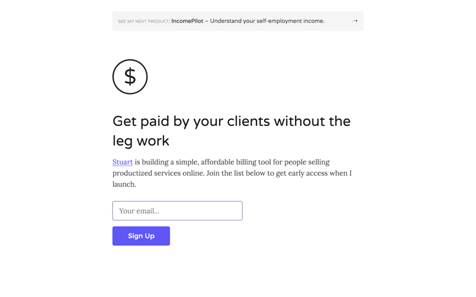
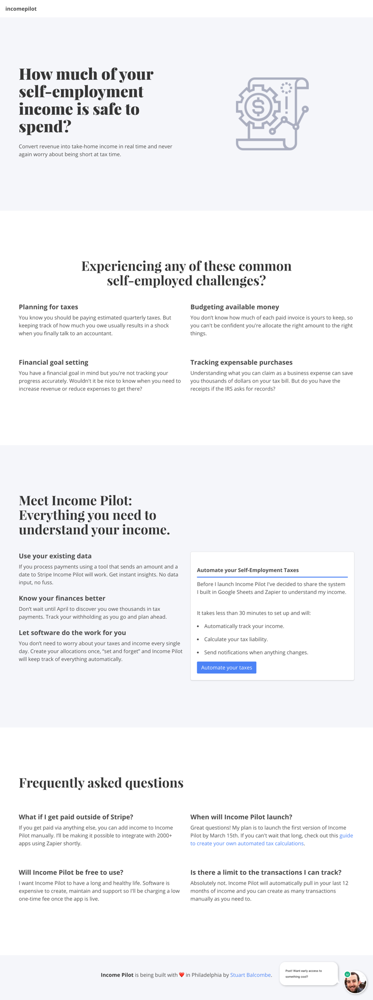
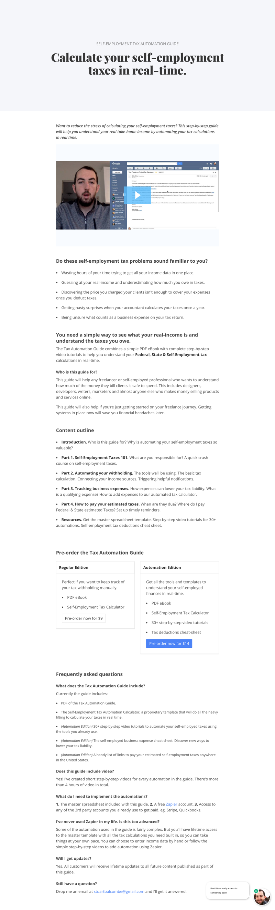

---

title: Building landing pages to test assumptions

date: "2018-02-21T22:12:03.284Z"

path: "/building-landing-pages-to-test-assumptions/"

category: "post"

tags: ["web app challenge"]

excerpt: "A simple landing page can help validate that people actually want your product. Before you build anything."

sell: "If you want to follow along, drop your info in the box below and I’ll send all the updates right to your inbox."

---

*This is an update from Week 6 of my [web app challenge](/tags/web-app-challenge/). I challenged myself to build a software product and generate $1000 in real revenue in 3 months.*

Deciding what to build can be a challenge. During my web app challenge I've shipped 3 different landing pages and created a [working prototype](/a/validating-product-ideas-no-code-required/) for my product idea. 

2 weeks ago I decided to create a landing page to test the water for my new idea. My hypothesis was that people wanted to better understand their self-employment income. 

Here's the process I use for creating landing pages to test product assumptions.

#### 1. Start with words

Starting with a text document instead of a code editor forces you to focus on your customer and how your product will improve their lives.

If you've already talked to some potential customers you already have an advantage. You can use your notes to match the content on your landing page to the way potential customers talk about their problems and goals they are trying to achieve.

The language you use needs to resonate with your intended customer and be specific to their needs. Remember, your goal is to help visitors understand how your product will help them overcome obstacles and improve their life.

#### 2. Focus on the hierarchy

Lay out the content on your page using a template to help keep visitors engaged and ensure your message matches their expectations.

This template by Joanna Wiebe at CopyHackers is one I've used for the last couple of years and keep coming back to every time I create a new landing page.

*Image credit: [Copyhackers](https://copyhackers.com/2016/06/copywriting-principles-sweatblock/)*

Once you've written your content it's a good idea to solicit some initial feedback from someone who knows nothing about your product. I find Google Docs to be a helpful tool for sharing copy and giving people the ability to make suggestions in context. 

#### 3. Use existing tools

So you've made a few tweaks to your copy based on feedback and now you're finally ready to think about design. The goal of this page is to  validate (or invalidate) your assumptions so it's a good idea to use whatever tools you know to help you ship quickly. Here are the tools I use.

- **Gatsby** - A static site generator built on React.js.

- **Nuxt** - A static site generator for Vue.js.

- **Netlify** - Quick and easy static hosting with deploys from Github out of the box. It's free for public repo's.

- **Mailchimp** - My newsletter provider. Free up to 2000 users and perfect for getting started.

- **Ship by Product Hunt** - Possibly the easiest ways to collect email addresses for a new product idea.

If you don't want to write any code. I recommend taking a look at Carrd.co to build simple landing pages with email capture forms and even payments out of the box.

#### 4. Keep the design simple and focused

It can be tempting to bring out all your design tricks to announce your new product. But... at this stage design is unlikely to be the deciding factor in whether someone joins your waiting list or not.

It is however, important to ensure your design looks clean and professional to build trust with your visitors. Here are some tips to save you time with your visual design.

- Use [Dribbble](https://dribbble.com) to find designs with a color palette you like and copy the exact HEX values they use for your own designs.

- Use [Font Pair](https://fontpair.co/) to identify a font pairing you like that you can access for free using Google Fonts.

- Consider using your product name vs a custom logo for your first iteration.

- If you're coding your own landing page. Use a CSS framework like [Bulma](https://bulma.io/) or [Bootstrap](https://getbootstrap.com/) to do the heavy lifting and give you everything you need out of the box.

- Let your content breathe. Don't be afraid to add extra whitespace between page elements.

### Examples

At this point you should have a landing page that looks professional and clearly explains how your customers lives will be improved by your product. Before you hit the big green button and set it live take a few moments to check all your links work and that you've added descriptive meta tags. Below you'll find the 3 landing pages I created for my challenge.

#### Pre-launch splash page

[View the live page](https://www.paymentlink.me)

#### Sign up for early access to a SaaS product

[View the live page](https://www.myincomepilot.com)

#### Pre-order an information product

[View the live page](https://www.myincomepilot.com/calculate-self-employment-tax-guide/)

Once your landing page has been successfully deployed, all that remains is to start telling people about it and gathering feedback. If you're not convinced about the power of landing pages as a testing tool, I recommend taking a look at [this video](https://www.youtube.com/watch?v=YaHXZT6RNs8) from Justin Jackson.

### Week Summary

I worked on my [Web App Challenge](https://www.stuartbalcombe.com/a/my-web-app-challenge) for a total of **23 hours** over the past 2 weeks. Here’s how my time was broken down.

- Copywriting (3 hours)

- Landing Page Design (2 hours)

- Customer Research (4 hours)

- Creating a prototype and recording a video (2 hours)

- Tech stack research/learning (12 hours)

**I have 1 goal for the next week:**

- Identify a clear path forward and commit.

This post marks the half-way point in my Web App Challenge. The goal is to generate $1000 in revenue by April 10th. Here's where the numbers stand so far.

**Revenue**
$19 (1 pre-order)

**Expenses**
$23.16 (2 domain names)

I'll be reflecting on the experience and sharing my thoughts on the challenge thus far later this week.