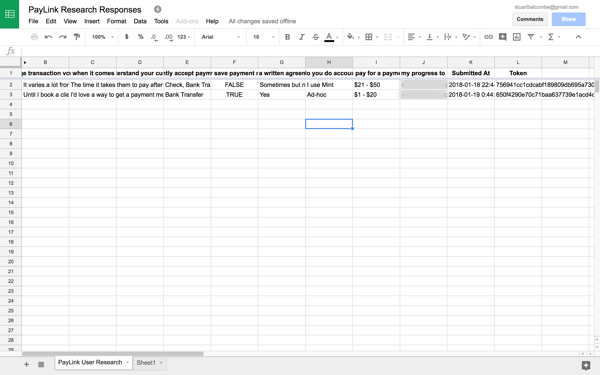

The easy way to start a new project is to dive right in, open Sketch or Sublime Text and start creating. We’ve all been there, but starting with solutions can be a very costly mistake. 

**The first step in the product development process should always be to understand the problem you’re trying to solve.**

Identifying and validating problems is actually pretty simple. Here’s the 4 step process I use to discover problems and inform solution design.

#### 1. Identify your target audience

The first step to identifying problems is to pick a target audience and find where they hang out. It's important to remember that this is just a starting point. The goal is to let your research guide your path forward. If you've experienced a problem yourself you may already know where to find other people like you.

Here are my favorite places for finding people to ask about their problems.

- **Personal Network:** Great if you are investigating a problem you've experienced yourself. The chances are you know some people like you who have similar pains. But it’s important to be careful when using this channel to validate demand, friends are more likely to give biased responses. Always ask about purchase intent.

- **Reddit:** With more than 250 million users conveniently segmented by subreddit Reddit is a good place to learn more about the challenges people are facing in their own lives. There are 2 ways I use Reddit in my research. 1) Trawling relevant subreddits to discover the questions potential users are asking and the solutions they have already hired. 2) Direct messaging Reddit users who asked questions of the forum to learn more and schedule a phone conversation.

- **Online Communities (Slack, Facebook, LinkedIn):** One of my favorite ways to learn about customer problems is to join communities where they are already being discussed. A quick Google, or Facebook search for: "your target audience" + "community" will give you a good starting point.

- **Twitter:** One way to identify people having frustrating experiences with products is to use Twitter's Advanced Search feature. By searching for mentions of products aimed at your target audience you will likely uncover the type of support issues they receive, along with any common requests for features. Both of these communications represent opportunities to start a conversation and learn how resolving that specific pain point would impact the person's life.

- **BuiltWith:** An easy way to get a list of companies using competitor products. Remember the goal is not to start selling these people on your idea but to learn about how and why they hired their current solution to a problem.

**Be sure to read the rules for any community you join and post in, as many ban self-promotion.** As a general rule, try to add value to every interaction you have.

For my challenge, I already have a good starting point for the target audience. I've been interviewing creative professionals for the past 2 years while working on Compass and Sail. I've also had to go through the process of hiring a way to get paid for client work myself. I decided to use **my personal network, online communities, and BuiltWith** to find people to interview.

#### 2. Make contact

Once you’ve found your target audience, I've found the best next step is to get them on the phone and have a conversation. Talking in real time makes it easy to ask follow up questions and get a deep understanding of the problem. The email template I use to do that is adapted from one first shared by Groove CEO, Alex Turnbull.

---

*Hey { first name },*

*I saw that you were using { product/service } to handle payments for your { product/service } and I was hoping I could bug you for 10 minutes to ask you a few questions. I've got nothing to sell, just wanted to hear about your experience with { product/service }.*

*Let me know – thanks!*

*{ your name }*

---

It's important to personalize this email as much as possible if you already know the recipient or have some context from your research. I’ve seen high response rates using this template and find most people are happy to talk about their own experiences.

By referencing an existing solution this template also provides an anchor point for the conversation and makes it easier to dig into your prospects frustrations. It’s especially useful if the existing solution is being paid for because you can quickly understand how valuable this solution is to the persons business.

If you work with clients and would be willing to spend 10 minutes telling me about your process for getting paid you can schedule a time to [chat on the phone here](https://www.calendly.com/stuartbalcombe/chat).

#### 3. Ask open questions

So you've identified someone in your target audience, got in touch and found a time to chat. But what should you ask them? 

The most important thing to remember when doing user research is: **Don't lead the witness**. Try to ask open-ended questions that encourage them to talk about their own experience. The goal is to keep the conversation about their problems and not pitch potential solutions. Here are some of the specific questions I use to understand customers existing problems and their process for hiring solutions.

- Tell me more about how you currently do X ( a task or activity).
- Tell me about how you looked for products to do X.
- What other solutions did you try?
- Who else did you talk to about solving your problem before you chose a solution?
- What frustrates you about your current solution?
- What would solving this pain do for your business?

If the conversation slows try asking: **"How do you do X?"** or **"What sort of questions do people ask you about X?"**.

It's important to keep good notes of your conversations so that you can refer to them later. For convenience, I added my questions to Typeform as [a quick survey](https://stuartbalcombe.typeform.com/to/tY17wm). This approach also makes it easy to get responses from people who are unable to talk on the phone. One reason I love Typeform for user research is the ability to automatically pipe responses to Google Sheets for easy record keeping.

#### 4. Create job stories

The final step in the research process is to distill my customer conversations into Job Stories. These simple statements will be focused on the Job to be Done and will make it much easier to translate research into design decisions later. If you're not familiar with the Jobs to be Done framework I recommend checking out [this video](https://hbswk.hbs.edu/item/clay-christensens-milkshake-marketing) by Harvard professor Clay Christenson.

Job stories combine context from the situation in which users experience their problem with details about their motivation for "hiring" a solution.

Here is an example job story I created from my research.

**When**

When a potential client visits a designer's website and decides they want to work with them on a design concept...

**Motivation**

A client wants to quickly pay a deposit to hire a designer and reserve time in their schedule...

A designer wants to ensure they are not introducing any friction by not being available to follow up...

A designer wants to make sure they receive payment before completing any work...

A designer wants to ensure clients to agree to their payment terms and saves a payment method on file...

**Expected Outcome** 

So that a client can receive their design concepts quickly, and the designer can be safely compensated for their time.

I've been working with Job Stories in all my product design for the past 2 years and find them incredibly powerful tools not only for designing features but for writing marketing copy as well.

### Key observations

This week I had 6 phone conversations with independent business owners and another 7 via email. The people I spoke to had 2 core problems with their existing solutions.

1. **Convenience + Flexibility**

Almost everyone I spoke to referenced onboarding new clients as a frustration with their existing solution. There were several reasons why this was important. Some felt they were a blocker to momentum in their process when they needed to do a manual task like sending an invoice to allow leads to become clients. Often existing tools did not cater to a specific use case (like authorizing payment without making a charge) or did not provide the flexibility necessary for managing an ongoing relationship after an initial payment was made.

2. **Cost** 

People who process a high volume of monthly payments such as marketing or design agencies had 2 primary cost-related concerns.

a) Getting paid using a credit card results means incurring a huge expense in the form of transaction fees. Most services (such as Stripe or PayPal) charge about 3% to process credit or debit cards. This means that for an agency billing $100k per month they are leaving $3000 on the table just to receive their money. Every person I spoke to who processes more than $10k in payment per month listed being able to accept payment via bank transfer as a primary consideration in their buying process.

b) When asked about their process for purchasing a solution for getting paid by clients everybody who processed more than 10k per month said they would prefer a product with a fixed monthly fee vs one that added a percentage on top of standard merchant fees.

Later this week I'll be sharing more details about the solution I'll be building in response to these observations.

### Week Summary

This was the first week I actively worked on my [Web App Challenge](https://www.stuartbalcombe.com/a/my-web-app-challenge) with a total of **18 hours** spent heads down on the project.

- Customer Research (8 hours)
- Design (2 hours)
- Coding / Reading about code (8 hours)

The ratio of coding to customer research seems high but given my technical limitations I wanted to get a head start and figure out how to implement basic functionality that would be required to build any SaaS app. To this end, I started with authentication using Firebase.

As you may have noticed, there's still some tidying up to do here. I need to add form validation, password resets and provide a way to access authenticated users data in the navbar.

**I have 2 goals for the next week:**

1. To complete 5 more user interviews and create a prototype of the initial solution. Want to help inform the design? Complete my [quick research survey](https://stuartbalcombe.typeform.com/to/tY17wm).

2. To complete the authentication flow and integrate with Stripe to capture payment information before allowing access to the dashboard. I'm thinking I'll open source the authentication and payment unit as a starter kit for anyone building SaaS products on top of Firebase. Shoot me an email [stuartbalcombe@gmail.com](mailto:stuartbalcombe@gmail.com) if you'd be interested.
